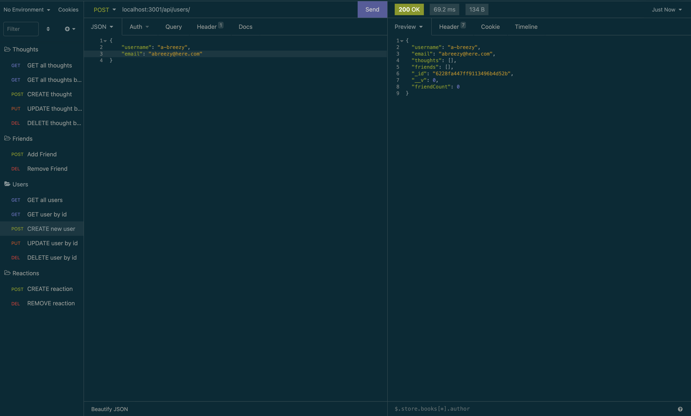
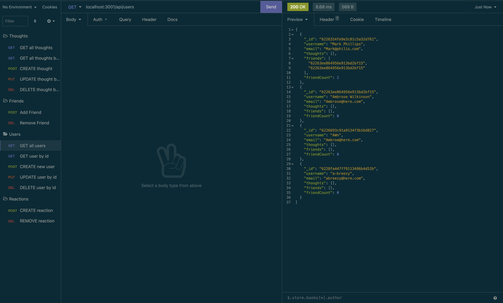
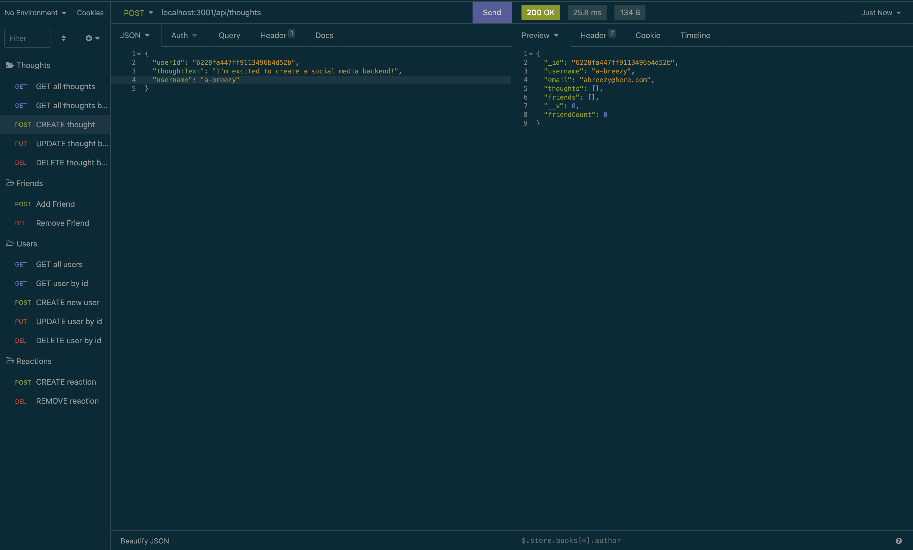
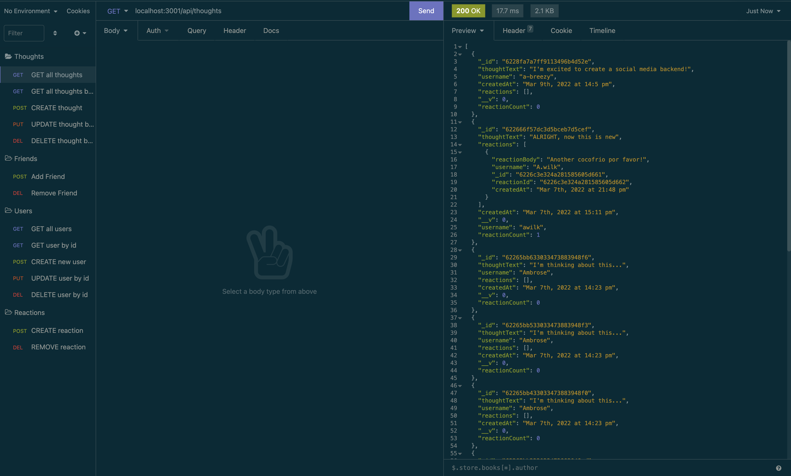
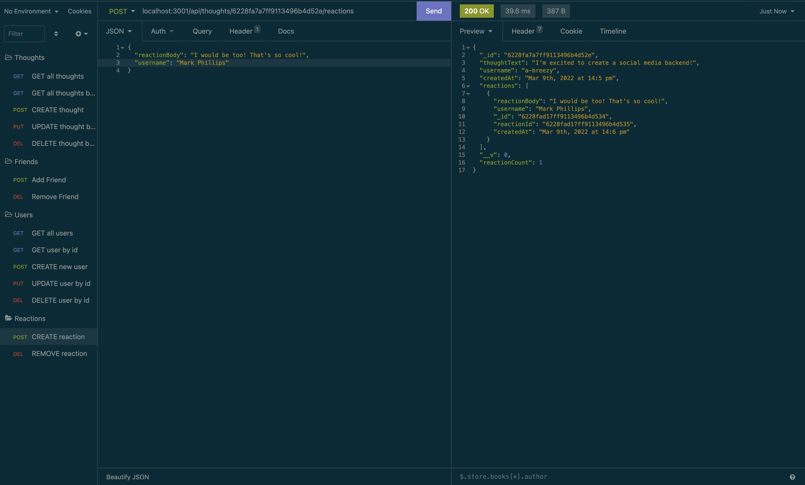
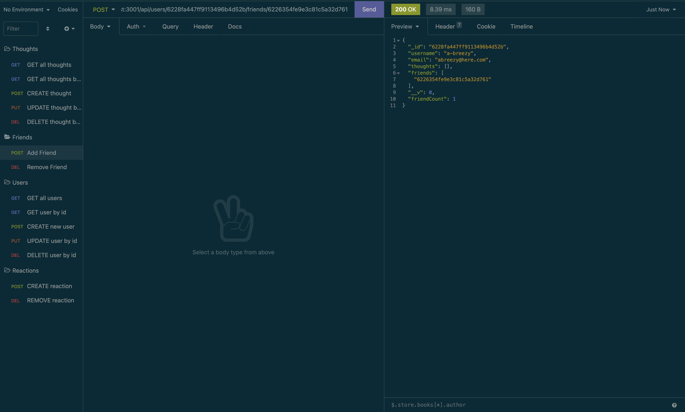
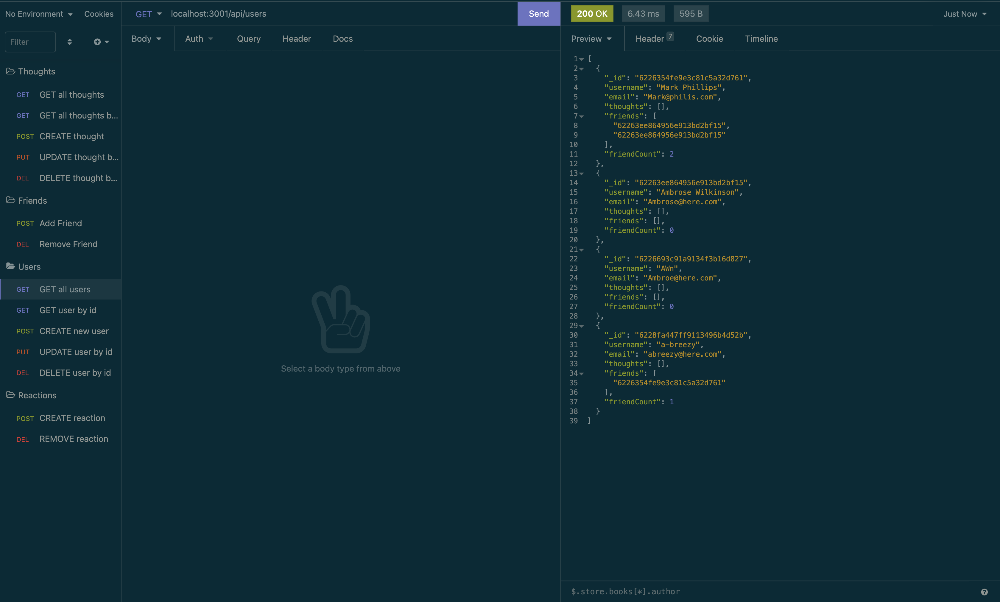

# Friendly Thoughts Social Media Backend 

Friendly Thoughts is a social media app backend. Mongoose is the ODM used to create models to manage the MongoDB database. Controllers, Routes, and a Server are included so that all the user needs is to create a front end.

 for Users and Thoughts to manage users and their connections to others
  
## Description

This repo is meant to streamline the creation of a social media app but providing the backend for users with a front end. We've used MongoDB as the database, with models, routes, and controllers to manage how the data relates to one another.

There are two models: User and Thought. The User model provides the framework for how the user data is set up. The Thought model has a thought schema as well as a reaction schema where users can react to the thoguhts of others.

Virtuals are also included to count the amount of friends a user has and the amount of reactions a thought has.

Routes have been set up in a seemless manner using the built in functionality of MongoDB. Likewise users and thoughts are controlled using MongoDB's CRUD methods.

[GitHub Repo](https://github.com/a-breezy/friendly-thoughts)
[Video of Deployed API](https://drive.google.com/file/d/16TMk1ylsomqypJ1trEfhofI053DPvML3/view)

## Table of Contents

  * [Installation](#installation-instructions)
  * [Usage](#usage)
  * [License](#license)
  * [Collaborators](#collaborators)
  * [How to Contribute](#how-to-contribute)
  * [Tests](#tests)
  * [Questions](#questions)

## Installation Instructions

Clone [this repo](https://github.com/a-breezy/friendly-thoughts) and connect to your front end. Run `npm start` to start server. Deploy wherever you choose.

If you prefer to test it out without deploying a front end, clone [this repo](https://github.com/a-breezy/friendly-thoughts) and run `npm start` to test routes on whatever platform you use to test APIs.

---
## Usage

*Creating a New User*
*Showing the New User Created*
*Creating a New Thought*
*Showing the New Thought Created*
*Creating a New Reaction*
*Creating a  Friend Association*
*Showing the Updated Friend Count*

---
## License

  [License: MIT](https://opensource.org/licenses/MIT)
  

---
## Collaborators

None

---
## How to Contribute

None

---
## Tests

None

---
## Questions

ambrose.wilkins@gmail.com
